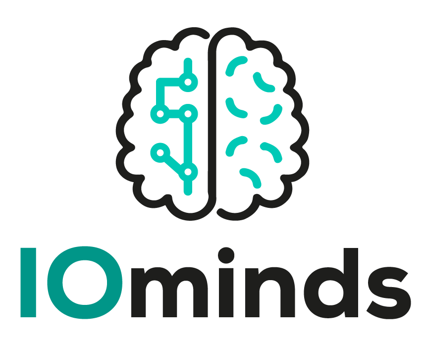

       

---

##   Descripción
_Nos dedicamos a crear soluciones tecnológicas innovadoras, cumpliendo estándares globales de la industria para brindar a nuestros clientes productos eficaces y de alto rendimiento._ 

##   Objetivo
Satisfacer las necesidades de nuestros clientes, aportando soluciones que permitan optimizar su gestión y competitividad.

##   Servicios
- Desarrollo web
- Desarrollo de aplicaciones de escritorio
- Desarrollo de aplicaciones móviles
- Análisis y Diseño de soluciones
- Optimización y calidad de aplicaciones [...]
- Mantenimiento y soporte tecnológico
- Outsourcing tecnológico
- Instalación de sistemas de seguridad
    - Cámaras
    - Alarmas

##  Productos
- Hardware de punto de venta
- Venta de PC’s
- Sistemas empaquetados 
    - Restaurante
    - Ferretería
    - Tienda de conveniencia
    - RNP
    - Repuestos y accesorios

##  Misión
Contribuir a la mejora permanente de nuestros clientes, poniendo a disposición y vendiendo productos y servicios que satisfagan, con excelencia, las demandas de los usuarios.

##  Visión
Ser una empresa de referencia, reconocida como la mejor en el segmento por clientes y empleados, por la calidad de nuestros productos, servicios y relación.

##  Valores
- Innovación y mejora continua
- Trabajo en equipo
- Colaboración
- Servicio

##  WebSite
[iominds.dev](https://iominds.dev)

##  Redes Sociales
- Facebook: [IOminds.dev](https://web.facebook.com/iominds.dev)
- Instagram: [IOminds.dev](https://www.instagram.com/iominds.dev)
- Twitter: [IOminds](https://www.twitter.com/iominds)
- GitHub: [IOminds](https://github.com/iominds)